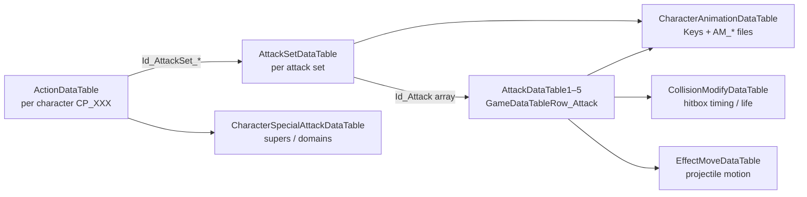

# Jujutsu Kaisen: Cursed Clash — UE5 DataTables map (combat / moves)

This document maps how exported **DataTable** JSON files in this folder relate to each other for combat and movement, based on the `RowStruct` types under `/Script/AbramsDataTable` and the row keys present in your export.

**Export caveat:** Some DataTables can still export with `Rows: {}` if FModel/SDK can't decode a row struct. In your updated export, `AttackDataTable1-5` and `DamageDataTable1-*` do contain per-hit rows, so you can tune per-hit state timing + hit slowdown/rigidity directly. Some other tables may still be empty; when that happens, the behavior is often sourced from montages or other assets.

---

## 1. ID naming (row keys)

| Pattern | Typical meaning |
|--------|------------------|
| `CP_NNN` | Playable-style character id (e.g. `CP_010`, `CP_020`). Used across action, attack, and animation tables. |
| `CN_NNN` | Appears on some enemies / alternate cast rows (e.g. in `ParallelAttackDataTable`, `ActionStepDataTable`). |
| `CP_NNN_ATTACK*` | Attack **set** id (e.g. `CP_010_ATTACKA`, `CP_010_ATTACKE_1`). Not the same as a single hit id. |
| `…_01_01`, `…_03_SETUP_01` | **Per-hit / phase** ids inside a set (see `AttackSetDataTable` → `Id_Attack[]`). `_SETUP` rows are setup phases before an active hit. |
| `_AIR` | Air variant of the same logical attack set. |
| `_SOLO` | Solo mode variant attack set (referenced from `ActionDataTable`). |
| `AM_CP_010_00_AttackA_01_01` | Animation montage **filename** referenced from `CharacterAnimationDataTable` (actual timing often lives in the montage / notifies). |

---

## 2. High-level data flow (what points to what)

1. **`ActionDataTable`** — For each character, lists which **attack set** ids are used for normals, air normals, cursed-energy strings, supers, plus ids for movement subsystems.
2. **`AttackSetDataTable`** — For each attack set, lists the ordered **`Id_Attack`** chain (up to 12 slots, padded with `"None"`), plus flags like `bCursedEnergyAttack` and inertia rates.
3. **`AttackDataTable1`–`5`** — Row struct `GameDataTableRow_Attack`. This tier contains per-hit/phase state timing + transition gating (e.g. `AttackTiming`, `AttackTransitionType/Kind`, and montage identifiers per phase).
4. **`CharacterAnimationDataTable`** — For each attack set (and base character), maps logical **animation keys** to **`AM_*` montage names**. Changing end lag often means editing those montages or whatever reads timing from `GameDataTableRow_Attack`.
5. **`CollisionModifyDataTable`** — Hitbox-related **durations** (`Life_Time`, `Size_Time`, `Location_Time`, `*WaitTime`) keyed by attack / phase ids (not always 1:1 with every `Id_Attack`; some keys are coarser, e.g. `CP_010_ATTACKC`).
6. **`EffectMoveDataTable`** — Projectile / effect **movement** (speed, homing, interpolation times). Tweaks **travel time**, not necessarily your character’s recovery.
7. **`CharacterSpecialAttackDataTable`** — Links character → special damage ids, domain expansion id, multi-hit flags, etc.

---

## 3. `ActionDataTable` (master character → subsystem ids)

**Row struct:** `GameDataTableRow_Action`  
**Import key:** `Id`

Per row (`CP_010`, `CP_020`, …):

- **`Id_ActionMove`**, **`Id_ActionJump`**, **`Id_ActionDash`**, **`Id_ActionStep`**, **`Id_ActionBreakFall`** — Row keys into the corresponding action tables (same string as character id in most cases, e.g. `CP_010`).
- **Normals / air:** `Id_AttackSet_Normal_1`, `_2`, `_3`, and matching `Id_AttackSet_Normal_Air_*`, plus `_1_1`, `_2_1`, `_3_1` for follow-up routes (and `_Solo` / `_Auto` variants where used).
- **Cursed energy:** `Id_AttackSet_CursedEnergy_1` / `_2` (and air + auto variants) are **arrays of four** attack set ids (pad with `"None"`).
- **Super:** `Id_AttackSet_SuperCursedEnergy`, `Id_AttackSet_SuperCursedEnergy_Air`.
- **Extra:** `Id_ExtraAttack_1`, `Id_ExtraAttack_2`.

**Shared rows:** Some characters reference another character’s step or breakfall id (e.g. `CP_020` using `CP_010` for `Id_ActionStep` / `Id_ActionBreakFall` in the sampled rows). Edit the **referenced** row if you want both to change.

---

## 4. `AttackSetDataTable` (attack set → ordered hit / phase ids)

**Row struct:** `GameDataTableRow_AttackSet`

Important fields:

- **`AttackRangeType`** — e.g. `EGameAttackRangeType::Short`.
- **`bCursedEnergyAttack`**, **`bRecoverCursedEnergyDisabled`**
- **`Inherit_Inertia_Rate`**, **`Inherit_Inertia_RateZ`** — how prior velocity carries into the set (feel of chain momentum, not literal “lag”).
- **`Id_Attack`** — Ordered list of **`GameDataTableRow_Attack`** row ids (e.g. `CP_010_ATTACKA_01_01`, `…_03_SETUP_01`, …).

Example (abbreviated): `CP_010_ATTACKA` chains multiple ids ending with `CP_010_ATTACKA_04_01`.

---

## 5. `AttackDataTable1`–`5` (per-hit attack logic)

**Row struct:** `GameDataTableRow_Attack`  
In this export it contains rows keyed by per-hit / phase ids like `CP_010_ATTACKA_01_01` (often referenced by `AttackSetDataTable` via `Id_Attack[]`).

Fields you can use for responsiveness:

- `CharacterAnimation` / `WeaponAnimation` (what anim/montage plays for this phase)
- `AttackTiming` and `DistanceDelayAttackTiming` (when this phase becomes active)
- `AttackTransitionType` / `AttackTransitionKind` (how the state machine chains/accepts inputs)
- `Id_ActionHoming` / `Id_CancelAttackActionHoming` and `bUpdateHomingLocation` (homing + some cancel behavior)
- `SimpleDomainCounterReceiveDelayTime` / `BlendInTime_*` (counter/blend timing)

End-lag unlock/cancel can still depend on montages/notifies, but this table is now where per-hit timing + transition gating lives.

---

## 6. Animation mapping

### `CharacterAnimationDataTable`

**Row struct:** `GameDataTableRow_CharacterAnimation`

- Rows include **`CP_010`** (locomotion, dash, damage reactions, etc.) and **`CP_010_ATTACKA`**, **`CP_010_ATTACKB`**, … — one row per **attack set** (and similar groupings).
- Each row has parallel arrays **`Key`** (logical anim name, e.g. `AttackA_04_01`) and **`Filename`** (e.g. `AM_CP_010_00_AttackA_04_01`).

These names align with the sequence implied by **`AttackSetDataTable`** `Id_Attack` ids (same attack family, `_01_01` ↔ `_01_01`, etc.).

### `CharacterAnimationSetDataTable`

**Row struct:** `GameDataTableRow_CharacterAnimationSet`

- Per character, lists **`Id_CharacterAnimation`** row ids to load (base body, facial parts, guard, step, jump, each `CP_XXX_ATTACK*` set, damage, etc.).

### `ParallelAttackDataTable`

**Row struct:** `GameDataTableRow_ParallelAttack`

- Maps special row ids → **`CharacterAnimation`** / **`CharacterAnimation_Lower`** strings when the game needs alternate anims (e.g. order vs not-order variants for certain moves).

---

## 7. Hitboxes and collision timing: `CollisionModifyDataTable`

**Row struct:** `GameDataTableRow_CollisionModify`

Keys include full hit ids (e.g. `CP_020_ATTACKA_01_01`) or broader ids (`CP_010_ATTACKC`).

Useful fields for **how long a hitbox exists** or how fast it grows/moves:

- **`Life_Time`** — How long the modifier stays active (seconds).
- **`Size_Time`**, **`Size_WaitTime`** — Timing for size interpolation.
- **`Location_Time`**, **`Location_WaitTime`**, **`Location`**, **`Size`**
- **`bLocation_AbsoluteRotation`**

Shortening **`Life_Time`** can make a move **stop threatening** sooner; it does not automatically shorten the **character anim** unless the game ties them tightly (verify in-game).

---

## 8. Projectile / effect motion: `EffectMoveDataTable`

**Row struct:** `GameDataTableRow_EffectMove`

Rows keyed like `CP_010_ATTACKG_01_01`. Fields include **`EffectMoveType`** (`Straight`, `Target`, …), **`Speed_Start` / `Speed_End`**, **`Speed_InterpolateTime`**, homing angles/times, **`Delay_Time`**, etc.

Useful when a move feels clunky because **the projectile is slow or tracks too long**, not because of local recovery.

---

## 9. Specials and domains: `CharacterSpecialAttackDataTable`

**Row struct:** `GameDataTableRow_CharacterSpecialAttack`

Per character:

- **`Id_Damage_SpecialTagCombo`**, **`Id_Damage_SoloSpecialAttack`**
- **`bMultiHitSoloSpecialAttack`**
- **`Id_DomainExpansion`** (or `None`)
- **`RankingRecord`**

Links outward to damage rows (also empty in this export for `DamageDataTable*.json`).

---

## 10. Movement tables (cancel windows & rigidity — relevant to “clunky” feel)

Row keys are usually the same **`CP_XXX`** as in `ActionDataTable`.

### `ActionDashDataTable1`–`5` (split across files)

**Row struct:** `GameDataTableRow_ActionDash`

**Important:** Each numbered file holds **different characters**. Search **all** `ActionDashDataTable*.json` for your `CP_XXX`.

Notable fields:

- **`NormalDash_Minimum_Time`**, **`NormalDash_CancelInput_Time`** — how soon you can cancel / take actions out of dash (seconds).
- **`NormalDashAir_*`**, **`HomingDashAir_*`** — air dash analogs (`HomingDashAir_CancelInput_Time` is often `0.0` in samples).
- **`Rigidity_DashBegin`**, **`Rigidity_DashEnd`**, **`Rigidity_DashAirBegin`**, **`Rigidity_DashAirEnd`** — enum rigidity classes (`Light`, `Normal`, `Heavy`, …).
- Gauge-related fields for dash cost and regen.

### `ActionJumpDataTable1`–`5` (split)

**Row struct:** `GameDataTableRow_ActionJump`

Examples:

- **`Jump_Minimum_Time`**, **`JumpAir_CancelInput_Time_Min`**
- Various **`Jump_*` / `RunJump_*` / `DashJump_*` / `JumpAir_*`** speeds and interpolation times
- **`Rigidity_JumpBegin`**, **`Rigidity_RunJumpBegin`**, **`Rigidity_DashJumpBegin`**, **`Rigidity_JumpAirBegin`**

### `ActionMoveDataTable`

**Row struct:** `GameDataTableRow_ActionMove`

Run speed, guard air drift, landing inertia, **`Rigidity_Landing`**, **`ParallelAttack_Speed_Rate`**, etc. Tweaks **locomotion** and landing stiffness more than a single attack’s recovery.

### `ActionStepDataTable`

**Row struct:** `GameDataTableRow_ActionStep`

- **`CoolTime`**, **`Step_Time`**, speeds, inertia, homing invalidate distance
- **`StepEnd_PlayRate`**, **`StepAirEnd_PlayRate`** — **animation play rate** on step end (raising these can shorten the visible end of step if the anim is the bottleneck).

### `ActionBreakFallDataTable`

**Row struct:** `GameDataTableRow_ActionBreakFall`

Includes **`Down_CancelInput_Time`**, **`Blow*_CancelInput_Time`**, **`Invincible_Time`** — relevant to **hit reactions** and when you regain control, not normal attack end lag.

---

## 11. Other tables you may touch for combat feel

| File | Role |
|------|------|
| `BindingVowsEffectDataTable.json` | Passive / equipment-style effects; includes enums like `StepRigidity`, `GuardBreakRigidity` (modifiers, not base moves). |
| `BuffDebuffDataTable.json` | Status effects (including link-combo related buffs). |
| `DomainExpansionRateDataTable.json` | Domain-related rates (meta progression / tuning). |
| `CameraShakeDataTable.json`, `CameraDataTable.json` | Presentation; can indirectly affect perceived impact. |

---

## 12. Practical modding notes for “less end lag”

1. **Confirm where timing lives:** In your updated export, per-hit activation + transition gating are in `AttackDataTable*` (`AttackTiming`, `AttackTransitionType/Kind`). Hit-freeze / rigidity feel is largely in `DamageDataTable*` (e.g. `HitSlow_Time_Attacker`, `HitSlow_Time_Guard_Attacker`, `Guard_Rigidity_Time`, `RestraintTime`). Animation montages still control the visible unlock/cancel timing, so verify in-game.
2. **DataTables you can already tune in this export:**
   - **Dash / jump cancel windows** — `ActionDashDataTable*`, `ActionJumpDataTable*`.
   - **Step end speed** — `StepEnd_PlayRate` / `StepAirEnd_PlayRate` in `ActionStepDataTable`.
   - **Per-hit chaining/cancel gating** — `AttackDataTable*` (`AttackTiming`, `AttackTransitionType/Kind`, `Id_CancelAttackActionHoming`).
   - **Hit freeze / rigidity affecting perceived end-lag** — `DamageDataTable*` (`HitSlow_Time_*`, `Guard_Rigidity_Time`, `RestraintTime`, `Knockback_*_Time`).
   - **Hitbox lifetime** — `CollisionModifyDataTable` `Life_Time` (and related timing fields).
   - **Projectile travel** — `EffectMoveDataTable` speeds and interpolation.
3. **Split files:** For `ActionDash`, `ActionJump`, `ActionHoming`, etc., **search all numbered JSON files** for your character id; rows are not guaranteed to be in `*DataTable1.json`.
4. **UE module name:** Custom structs live under **`AbramsDataTable`** — useful when searching decompiled blueprints or C++ if you go deeper.

---

## 13. Quick reference — main row structs

| Table | Row struct class |
|-------|-------------------|
| `ActionDataTable` | `GameDataTableRow_Action` |
| `AttackSetDataTable` | `GameDataTableRow_AttackSet` |
| `AttackDataTable1`–`5` | `GameDataTableRow_Attack` |
| `CharacterAnimationDataTable` | `GameDataTableRow_CharacterAnimation` |
| `CharacterAnimationSetDataTable` | `GameDataTableRow_CharacterAnimationSet` |
| `ParallelAttackDataTable` | `GameDataTableRow_ParallelAttack` |
| `CollisionModifyDataTable` | `GameDataTableRow_CollisionModify` |
| `EffectMoveDataTable` | `GameDataTableRow_EffectMove` |
| `CharacterSpecialAttackDataTable` | `GameDataTableRow_CharacterSpecialAttack` |
| `ActionDashDataTable*` | `GameDataTableRow_ActionDash` |
| `ActionJumpDataTable*` | `GameDataTableRow_ActionJump` |
| `ActionMoveDataTable` | `GameDataTableRow_ActionMove` |
| `ActionStepDataTable` | `GameDataTableRow_ActionStep` |
| `ActionBreakFallDataTable` | `GameDataTableRow_ActionBreakFall` |

---

*Generated from the JSON exports in this `DataTables` folder. Some DataTables may still export `Rows: {}` depending on struct decoding; re-run extraction if a specific table is empty when you expect tuning numbers.*
